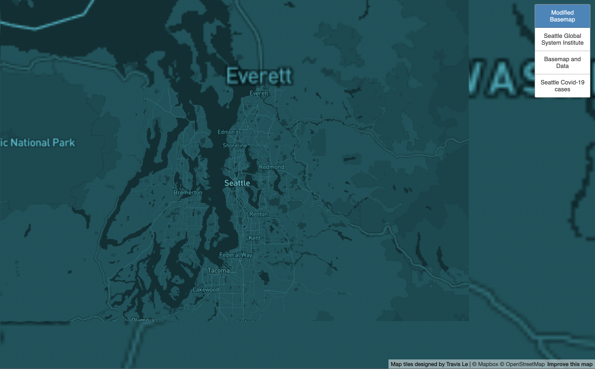

# Generating Map Tiles

Go to [map](https://travisle202.github.io/mapbox/)

## Tile 1 - Modified Basemap

- Description of Tile: Modified basemap to highlight the number of cities and areas around Seattle.
- Geographic Area of Focus: Seattle Washington and neighboring cities.
- Zoom Levels: Max Zoom - 12; Min Zoom - 8

## Tile 2 - Map Data (Seattle Global System Institute)

- Description of Tile: Data layer showing the location of different Global System Institute in Seattle. [Source](https://catalog.data.gov/dataset/gsi-points-b729f/resource/8ed42728-c734-4e2a-9781-0daa85f0d79b?inner_span=True)
- Geographic Area of Focus: Seattle Washington and neighboring cities 
- Zoom Levels: Max Zoom - 12; Min Zoom - 8

## Tile 3 - Basemap and Data 

- Description of Tile: Tile using the initial modified basemap and the mapped data from the second tile.
- Geographic Area of Focus: Seattle Washington and neighboring cities  
- Zoom Levels: Max Zoom - 12; Min Zoom - 8

## Tile 4 - Covid-19 thematic map

- Description of Tile: Covid-19 related data, using data available from [The New York Times](https://github.com/nytimes/covid-19-data/blob/43d32dde2f87bd4dafbb7d23f5d9e878124018b8/live/us-counties.csv)
- Geographic Area of Focus: Seattle Washington and neighboring cities 
- Zoom Levels: Max Zoom - 12; Min Zoom - 8
